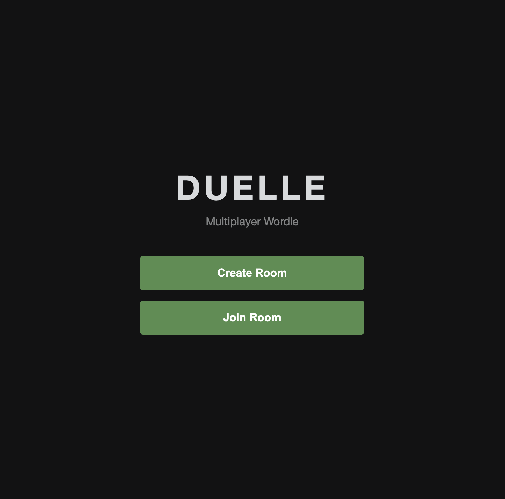
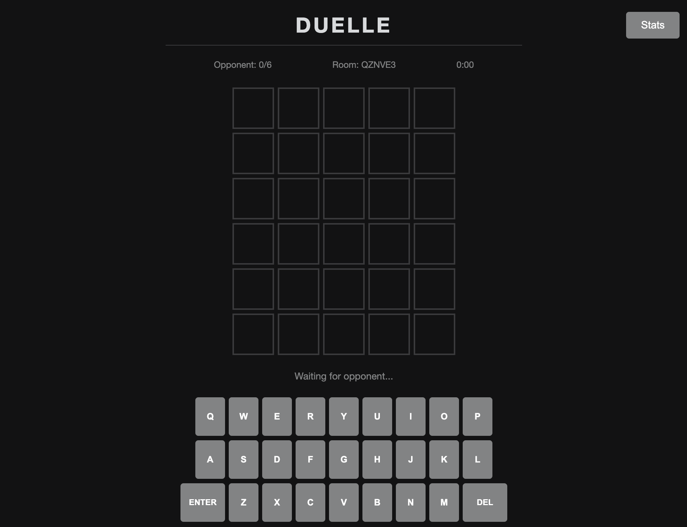
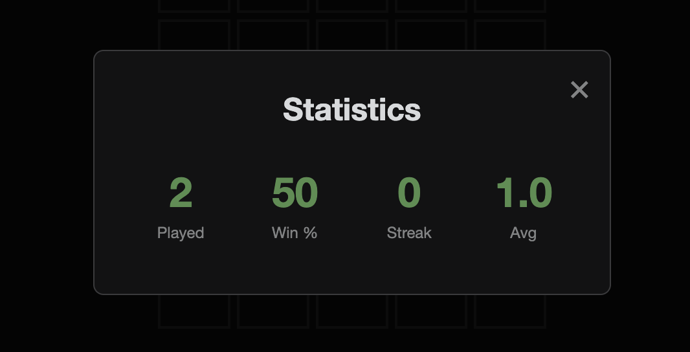

# Duelle

Duelle is a web playable wordle like game where you can play againt your firends and enjoy. The game is built with GO and html/css/js in frontend. 

Player connect to the domain and make a room where there are given the room code. their friends can join the room and play the game. The game is played and the player who gets the word faster wins the game.

Btw the word list is not ai generated rather from 

https://github.com/tabatkins/wordle-list 
Credits to himm 



## Motivation

I wanted to make a game like wordle but with some competition and enjoy with your friends and hence the idea of duelle came into my mind. 



## What I learned 

I understood alot about writing backend in go and understanding the fundamentals of web sockets and how to use them in a game. I also learned about how to deploy a go application on a server and make it accessible to the public (as the html/css/js are server by the backend to the client).



## Folder structure

(btw this tree is generated by online site which takes github link and generates tree structure :D so no ai )

```
duelle/
├── README.md
└── server/
    ├── cmd/
    │   └── duelle/
    │       └── main.go
    ├── go.mod
    ├── go.sum
    ├── internal/
    │   ├── config/
    │   │   └── config.go
    │   ├── game/
    │   │   ├── checker.go
    │   │   ├── manager.go
    │   │   ├── player.go
    │   │   └── room.go
    │   ├── handler/
    │   │   ├── health.go
    │   │   ├── static.go
    │   │   └── websocket.go
    │   └── words/
    │       ├── wordlist.txt
    │       └── words.go
    └── static/
        ├── app.js
        ├── index.html
        └── style.css

```

## Tech Stack

- Go
- Websockets
- HTML/CSS/JS


## AI usage notes

I used ai to mostly debug the code. I used it to make some parts of the ui. Rest of all the code is written by me.

## Thank you so much for reading, I really appreaciate it :D

